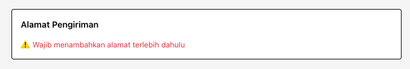

.
├── src/
│ ├── app/
│ │ ├── layout.tsx
│ │ ├── page.tsx <-- Homepage
│ │ │
│ │ ├── (auth)/ <-- Route Group (tidak muncul di URL)
│ │ │ ├── login/
│ │ │ │ └── page.tsx
│ │ │ └── register/
│ │ │ └── page.tsx
│ │ │
│ │ ├── product/
│ │ │ ├── page.tsx <-- Product listing
│ │ │ └── [slug]/
│ │ │ └── page.tsx <-- Product detail
│ │ │
│ │ ├── blog/
│ │ │ ├── page.tsx <-- blog listing
│ │ │ └── [slug]/
│ │ │ └── page.tsx <-- blog detail
│ │ │
│ │ │
│ │ ├── collections/
│ │ | └── all-product/
│ │ │ ├── page.tsx <-- Product listing
│ │ │ └── [slug]/
│ │ │ └── page.tsx <-- Product detail
│ │ │
│ │ ├── cart/
│ │ │ └── page.tsx
│ │ ├── account/
│ │ │ └── page.tsx
│ │ │
│ │ ├── checkout/
│ │ │ └── page.tsx
│ │ │
│ │ ├── contact/
│ │ │ └── page.tsx
│ │ │
│ │ ├── faqs/
│ │ │ └── page.tsx
│ │ │
│ │ ├── privacy-policy/
│ │ │ └── page.tsx
│ │ │
│ │ ├── api/
│ │ │ ├── products/
│ │ │ │ └── route.ts
│ │ │ ├── auth/
│ │ │ │ └── route.ts
│ │ │ └── checkout/
│ │ │ └── route.ts
│ │ │
│ │ ├── terms/
│ │ │ └── page.tsx
│ │ │ └── page.tsx
│ │ │
│ │ ├── globals.css
│ │ └── favicon.ico
│ │
│ ├── components/
│ │ ├── navigation/
│ │ │ ├── Header.tsx
│ │ │ └── Footer.tsx
│ │ ├── account/
│ │ │ ├── OrderCard.tsx
│ │ │ ├── OrderList.tsx
│ │ │ └── OrderTabs.tsx
│ │ │
│ │ ├── products/
│ │ │ ├── ProductCard.tsx
│ │ │ └── ProductGrid.tsx
│ │ ├── home/
│ │ │ └── categories/ <-- Product listing
│ │ │ | └── Categories.tsx
│ │ │ └── Banner.tsx
│ │ │
│ │ ├── ui/
│ │ │ ├── Button.tsx
│ │ │ ├── Input.tsx
│ │ │ └── Skeleton.tsx
│ │ │
│ │ └── cart/
│ │ └── CartItem.tsx
│ │
│ ├── lib/
│ │ ├── axios.ts
│ │ ├── fetcher.ts
│ │ ├── orderStatus.ts
│ │ ├── products.ts
│ │ └── utils.ts
│ │
│ ├── store/
│ │ └── cartStore.ts <-- Zustand
│ │
│ ├── types/
│ │ ├── product.d.ts
│ │ ├── productMedia.d.ts
│ │ ├── order.d.ts
│ │ ├── auth.d.ts
│ │ ├── banner.d.ts
│ │ └── cart.d.ts
│ │
│ └── styles/
│ └── globals.css <-- auto-used oleh `app/globals.css`
│
├── public/
│ ├── images/
│ │ ├── hero.jpg
│ │ ├── product-1.jpg
│ │ ├── product-2.jpg
│ │ └── product-3.jpg
│ ├── logo.svg
│ └── placeholder.png
│
├── .env.local
│
├── next.config.ts
├── postcss.config.mjs
├── tailwind.config.ts
├── tsconfig.json
├── eslint.config.mjs
└── package.json

<!-- ├── src/
│   ├── app/
│   │   ├── layout.tsx
│   │   ├── page.tsx                   <-- Homepage
│   │   │
│   │   ├── (auth)/                   <-- Route Group (tidak muncul di URL)
│   │   │   ├── login/
│   │   │   │   └── page.tsx
│   │   │   └── register/
│   │   │       └── page.tsx
│   │   │
│   │   ├── product/
│   │   │   ├── page.tsx              <-- Product listing
│   │   │   └── [slug]/
│   │   │       └── page.tsx          <-- Product detail
│   │   │
│   │   ├── blog/
│   │   │   ├── page.tsx              <-- blog listing
│   │   │   └── [slug]/
│   │   │       └── page.tsx          <-- blog detail
│   │   │
│   │   │
│   │   ├── collections/
│   │   |   └── all-product/
│   │   │       ├── page.tsx              <-- Product listing
│   │   │       └── [slug]/
│   │   │           └── page.tsx          <-- Product detail
│   │   │
│   │   ├── cart/
│   │   │   └── page.tsx
│   │   ├── account/
│   │   │   ├── layout.tsx                 <-- Layout akun (sidebar + outlet)
│   │   │   ├── page.tsx                   <-- redirect default ke profile / orders
│   │   │   │
│   │   │   ├── profile/
│   │   │   │   └── page.tsx               <-- Halaman profil
│   │   │   │
│   │   │   ├── orders/
│   │   │   │   ├── page.tsx               <-- Tabbing orders (semua pesanan)
│   │   │   │   ├── [orderId]/
│   │   │   │   │   └── payment/
│   │   │   │   │       └── page.tsx       <-- Halaman pembayaran order
│   │   │   │   └── components/            <-- optional: khusus orders UI
│   │   │   │       ├── OrdersTable.tsx
│   │   │   │       └── OrderDetail.tsx
│   │   │   │
│   │   │   ├── addresses/
│   │   │   │   └── page.tsx               <-- halaman alamat
│   │   │   │
│   │   │   ├── vouchers/
│   │   │   │   └── page.tsx               <-- voucher
│   │   │   │
│   │   │   └── settings/
│   │   │       └── page.tsx               <-- pengaturan akun
│   │   │
│   │   ├── checkout/
│   │   │   └── page.tsx
│   │   │
│   │   ├── contact/
│   │   │   └── page.tsx
│   │   │
│   │   ├── faqs/
│   │   │   └── page.tsx
│   │   │
│   │   ├── privacy-policy/
│   │   │   └── page.tsx
│   │   │
│   │   ├── api/
│   │   │   ├── products/
│   │   │   │   └── route.ts
│   │   │   ├── auth/
│   │   │   │   └── route.ts
│   │   │   └── checkout/
│   │   │       └── route.ts
│   │   │
│   │   ├── terms/
│   │   │   └── page.tsx
│   │   │   └── page.tsx
│   │   │
│   │   ├── globals.css
│   │   └── favicon.ico
│   │
│   ├── components/
│   │   ├── navigation/
│   │   │   ├── Header.tsx
│   │   │   └── Footer.tsx
│   │   ├── account/
│   │   │   ├── Sidebar.tsx                <-- Sidebar akun
│   │   │   ├── AccountLayout.tsx          <-- UI layout global akun (opsi)
│   │   │   ├── OrderCard.tsx
│   │   │   ├── OrderList.tsx
│   │   │   └── OrderTabs.tsx
│   │   │
│   │   ├── products/
│   │   │   ├── ProductCard.tsx
│   │   │   └── ProductGrid.tsx
│   │   ├── home/
│   │   │   └── categories/             <-- Product listing
│   │   │   |    └── Categories.tsx
│   │   │   └── Banner.tsx
│   │   │
│   │   ├── ui/
│   │   │   ├── Button.tsx
│   │   │   ├── Input.tsx
│   │   │   └── Skeleton.tsx
│   │   │
│   │   └── cart/
│   │       └── CartItem.tsx
│   │
│   ├── lib/
│   │   ├── axios.ts
│   │   ├── fetcher.ts
│   │   ├── orderStatus.ts
│   │   ├── products.ts
│   │   └── utils.ts
│   │
│   ├── store/
│   │   └── cartStore.ts              <-- Zustand
│   │
│   ├── types/
│   │   ├── product.d.ts
│   │   ├── productMedia.d.ts
│   │   ├── order.d.ts
│   │   ├── auth.d.ts
│   │   ├── banner.d.ts
│   │   └── cart.d.ts
│   │
│   └── styles/
│       └── globals.css               <-- auto-used oleh `app/globals.css`
│
├── public/
│   ├── images/
│   │   ├── hero.jpg
│   │   ├── product-1.jpg
│   │   ├── product-2.jpg
│   │   └── product-3.jpg
│   ├── logo.svg
│   └── placeholder.png
│
├── .env.local
│
├── next.config.ts
├── postcss.config.mjs
├── tailwind.config.ts
├── tsconfig.json
├── eslint.config.mjs
└── package.json -->

<!-- flow CHECKOUT Sinkron on my DB -->

Cart Page
↓ select item + press proceed
Checkout Page
↓ pilih payment method
Submit checkout
↓ 200
redirect → /account?tab=pending

after klik paynow(modal)
1.muncul modal ada count down 1x24 jam(hitng mndurr)
2.redirect 3s ke pages thankyou for payment 
3. panggil username di halaman thankyou pake layout header footer
setelah thank you ksh button back to shop .

handle Adress checkout page.

tambahkan icon pencil handle edit alamat, ada atau tdk ada alamat default wajib ada dan harus bisa edit di page checkout tanpa pindah halaman.
api.put user address. + button disabled klw blm punya alamat..[done]

<!-- TOTAL -->
total ini seharusnya total subtotal barang price + harga shipping method yg staatic orders detail

              Total
              
                Rp {Number(order.total_amount).toLocaleString("id-ID")}
              
            
[done]

harus dari total langsung post api orders[done]

home harus selsai semua sesuai doc.([flashsale, ](https://discordapp.com/channels/1419528406332215328/1419528406995046457/1449027250576949329))